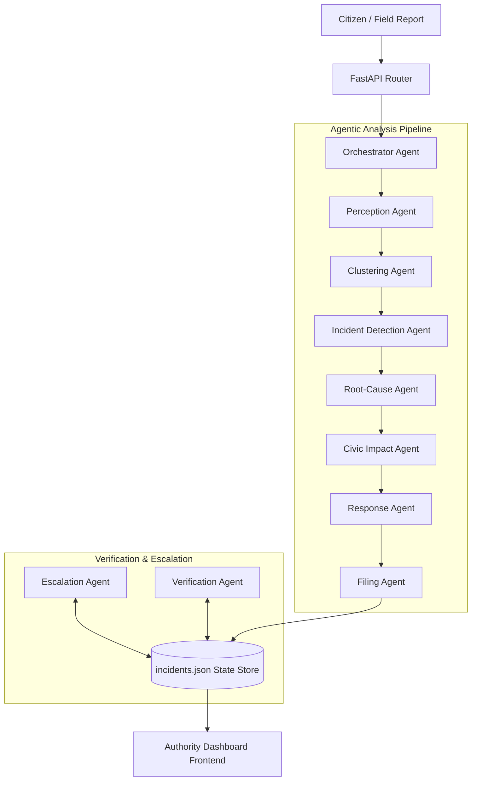
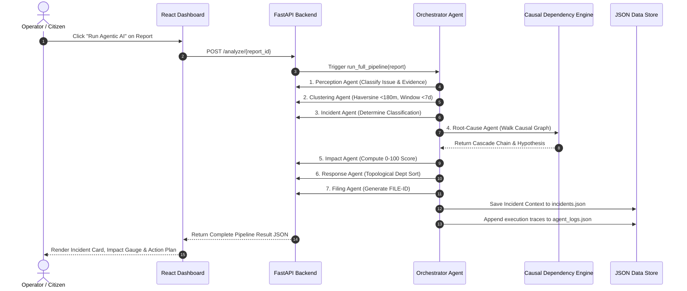
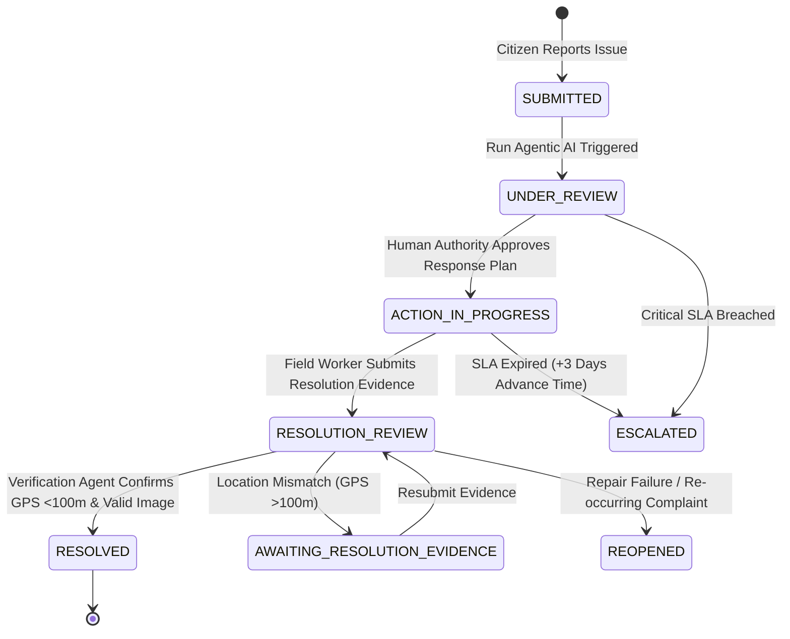

# OmniCivic AI — System Architecture & Workflow Diagram

---

## 1. High-Level Multi-Agent Architecture

OmniCivic AI relies on a multi-agent backend architecture where specialized agents process raw citizen reports, construct spatial/temporal clusters, hypothesize root-cause cascades, compute priority scores, design multi-department plans, and verify resolution evidence.



---

## 2. Multi-Agent System Pipeline Overview

| # | Agent Name | Primary Responsibility | Technical Logic / Tooling |
| :-: | :--- | :--- | :--- |
| **1** | **Perception Agent** | Analyzes image and text description to detect issue category, severity, and visual features. | Gemini Multimodal API or Deterministic Perception Lookup Table (`perception_lookup.json`). |
| **2** | **Clustering Agent** | Finds geographically and temporally related reports. | Pure Python Haversine distance ($d \le 180\text{m}$) and time window ($\Delta t \le 7\text{ days}$) math. |
| **3** | **Incident Detection Agent** | Determines relationship classification of the cluster. | Rule evaluation: `INDEPENDENT`, `DUPLICATE`, `POSSIBLE_CONNECTED`, or `HIGH_CONFIDENCE_CONNECTED`. |
| **4** | **Root-Cause Agent** | Traces causal connections between multiple issues. | Graph walk over `civic_dependencies.json` + Claude LLM cascade hypothesis synthesis. |
| **5** | **Civic Impact Agent** | Scores public threat severity (0–100). | Weighted multi-factor formula (Severity, Proximity, Impacted count, Duration, Repeats, Secondary Risks). |
| **6** | **Response Agent** | Designates multi-department resolution steps. | Topological dependency sort matching roles and execution order (`departments.json`). |
| **7** | **Filing Agent** | Generates formal, traceable municipal filings. | Generates official context code `FILE-[INC_ID]` clearly marked as simulated. |
| **8** | **Escalation Agent** | Tracks SLA deadlines and alerts management. | State machine transitioner checking deadlines + demo time-travel trigger (+72h). |
| **9** | **Verification Agent** | Validates resolution claims via photo/GPS proof. | Haversine location threshold ($<100\text{m}$) + post-repair image matching. |
| **10** | **Orchestrator Agent** | Coordinates pipeline execution and state persistence. | Writes and persists updates to shared state store (`incidents.json` & `agent_logs.json`). |

---

## 3. End-to-End Sequence Diagram



---

## 4. State Machine Diagram



---

## 5. Repository File Structure

```
OmniCivic AI/
├── PRD.md                       # Product Requirements Document
├── TRD.md                       # Technical Requirements Document
├── ARCHITECTURE.md              # Architecture & Workflow Specification
├── FEATURES.md                  # Detailed Feature Breakdown
├── DESIGN.md                    # UI/UX Design System Specification
├── README.md                    # Project Summary & Live Rehearsal Script
├── .env                         # Root Environment Variables
├── .env.example                 # Environment Variable Template
├── .gitignore                   # Version Control Exclusions
├── backend/
│   ├── main.py                  # FastAPI Server & Routes
│   ├── requirements.txt         # Python Dependencies
│   ├── .env                     # Backend Environment Copy
│   ├── agents/                  # Multi-Agent Pipeline Implementation
│   │   ├── orchestrator.py      # Pipeline State Coordinator
│   │   ├── perception.py        # Vision/Text Classification Agent
│   │   ├── clustering.py        # Spatial/Temporal Proximity Agent
│   │   ├── incident.py          # Cluster Relationship Classifier
│   │   ├── root_cause.py        # Causal Graph Analyzer
│   │   ├── impact.py            # Priority & Risk Scoring Agent
│   │   ├── response.py          # Multi-Dept Work Order Planner
│   │   ├── filing.py            # Simulated Municipal Filing Agent
│   │   ├── escalation.py        # SLA Deadline Monitor Agent
│   │   └── verification.py      # Resolution Proof Verification Agent
│   ├── tools/                   # Analytical Tools & Algorithms
│   ├── services/                # Multimodal (Gemini) & LLM (Claude) Services
│   ├── data/                    # JSON Persistence & Reference Configs
│   └── seed_images/             # High-Resolution Demo Evidence Photos
└── frontend/
    ├── package.json             # Frontend Dependencies & Scripts
    ├── vite.config.ts           # Vite Bundler Settings
    └── src/
        ├── App.tsx              # Main Application Component
        ├── pages/               # Dashboard & Report Pages
        ├── components/          # Reusable UI Cards, Gauges & Traces
        └── lib/api.ts           # API Service Client
```
