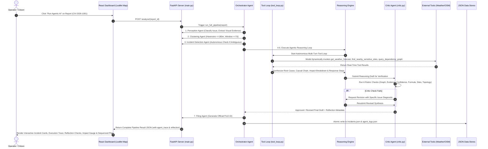
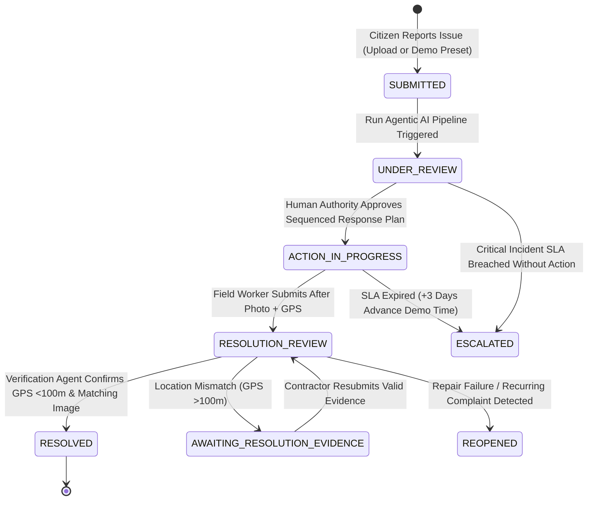

# OmniCivic AI — System Architecture & Workflow Diagram

---

## 1. High-Level Multi-Agent Architecture

OmniCivic AI operates on an autonomous multi-agent backend architecture orchestrated by FastAPI. Specialized agents collaborate to ingest raw citizen reports, generate spatial-temporal clusters, invoke real-time external analytical tools, synthesize causal root-cause hypotheses, compute priority scores, construct topologically sorted multi-department work orders, and verify field resolution evidence.

```mermaid
graph TD
    Sub[Citizen / Field Report (Upload or Demo)] --> MainApi[FastAPI Router (main.py)]
    MainApi --> Orch[Orchestrator Agent (orchestrator.py)]
    
    subgraph Multi-Agent Pipeline & Tool Calling
        Orch --> P1[Perception Agent (perception.py)]
        P1 --> C2[Clustering Agent (clustering.py)]
        C2 --> I3[Incident Detection Agent (incident.py)]
        I3 --> TL[Provider-Agnostic Tool Loop (tool_loop.py)]
        TL --> RE[Civic Reasoning Engine (reasoning_agent.py)]
        
        subgraph External Analytical Tools
            TL <--> W[Open-Meteo Weather API (48h Rain Risk)]
            TL <--> S[OSM Overpass API (Schools & Hospitals <250m)]
            TL <--> G[Civic Dependency Graph (civic_dependencies.json)]
            TL <--> H[Historical Incidents Store]
            TL <--> D[Haversine Spatial Math]
        end
        
        RE --> R4[Root-Cause Hypothesis & Chain]
        RE --> M5[Civic Impact Score & Priority]
        RE --> Plan6[Response Plan (Topological Dept Sorting)]
        
        Plan6 --> Critic[Critic / Reflection Agent (critic.py)]
        Critic -.->|If Rejected: 1 Revision Pass| RE
        Critic -->|Approved / Finalized| F7[Filing Agent (Municipal File ID)]
    end
    
    subgraph Multi-Provider LLM & Security
        LLM[LLM Manager (llm_manager.py)]
        TL <--> LLM
        LLM --- Groq[Groq LPU]
        LLM --- OpenAI[OpenAI GPT-4o]
        LLM --- Claude[Anthropic Claude]
        LLM --- Gemini[Google Gemini]
        LLM --- Local[Ollama / OpenRouter / HF]
        LLM --- Mock[Deterministic Simulation]
        LLM <--> Enc[(Fernet Encrypted provider_configs.enc.json)]
        Tok[Operator Token Auth X-Operator-Token] -.-> LLM
    end

    subgraph State Management & Verification
        Esc[Escalation Agent (escalation.py)] <--> State[(incidents.json State Store)]
        Verif[Verification Agent (verification.py)] <--> State
        State <--> CentralLogs[(agent_logs.json Central Log)]
    end

    F7 --> State
    State --> Dash[React Operations Dashboard + Leaflet Map]
```

---

## 2. Multi-Agent System Pipeline Overview

To maintain architectural honesty, OmniCivic distinguishes between **Autonomous Agents** (dynamic tool decisions, multi-turn reasoning, self-reflection, adaptive requests) and **Deterministic Algorithmic Engines** (deterministic math, graph traversals, and state machines):

### A. Autonomous Agents (Genuinely Agentic Decision Loops)
| # | Agent Name | File | Primary Responsibility | Agentic Autonomy Mechanism |
| :-: | :--- | :--- | :--- | :--- |
| **1** | **Orchestrator Agent** | [`orchestrator.py`](file:///d:/WebSites/OmniCivic%20AI/backend/agents/orchestrator.py) | Coordinates pipeline execution, state persistence, and audit logging. | Sole persistence authority for `incidents.json` & `agent_logs.json`; dynamically routes across agent execution waves. |
| **2** | **Civic Reasoning Agent** | [`reasoning_agent.py`](file:///d:/WebSites/OmniCivic%20AI/backend/agents/reasoning_agent.py) | Multi-turn reasoning to discover hidden infrastructure cascades. | Autonomous tool choice across 5 keyless tools via [`tool_loop.py`](file:///d:/WebSites/OmniCivic%20AI/backend/services/tool_loop.py); multi-turn state loop. |
| **3** | **Critic / Reflection Agent** | [`critic.py`](file:///d:/WebSites/OmniCivic%20AI/backend/agents/critic.py) | Self-critique and verification of causal reasoning drafts. | Validates 6 rubric checks; triggers autonomous revision passes or downgrades confidence with actionable diagnostics. |
| **4** | **Incident Detection Agent** | [`incident.py`](file:///d:/WebSites/OmniCivic%20AI/backend/agents/incident.py) | Categorizes cluster relationships (duplicate, cascade, independent). | Autonomous secondary check: when classification is ambiguous/low-confidence, queries historical store before finalizing. |
| **5** | **Verification Agent** | [`verification.py`](file:///d:/WebSites/OmniCivic%20AI/backend/agents/verification.py) | Verifies post-repair resolution claims. | Enforces strict $\le 100\text{m}$ pass boundary; returns `AWAITING_RESOLUTION_EVIDENCE` with structured requirements for ambiguous submissions. |

### B. Specialized Deterministic Engines & Algorithmic Modules
| # | Engine Name | File | Primary Responsibility | Technical Logic / Tooling |
| :-: | :--- | :--- | :--- | :--- |
| **6** | **Perception Engine** | [`perception.py`](file:///d:/WebSites/OmniCivic%20AI/backend/agents/perception.py) | Analyzes uploaded images and text descriptions to extract issue category and severity. | Gemini Vision API or deterministic visual feature table (`perception_lookup.json`). |
| **7** | **Clustering Engine** | [`clustering.py`](file:///d:/WebSites/OmniCivic%20AI/backend/agents/clustering.py) | Groups geographically and temporally related reports. | Pure Python Haversine distance ($d \le 180\text{m}$) and time window ($\Delta t \le 7\text{ days}$) math. |
| **8** | **Causal Graph Pathfinder** | [`root_cause.py`](file:///d:/WebSites/OmniCivic%20AI/backend/agents/root_cause.py) | Provides deterministic baseline causal chains. | Depth-first search traversal over `civic_dependencies.json`. |
| **9** | **Civic Impact Calculator** | [`impact.py`](file:///d:/WebSites/OmniCivic%20AI/backend/agents/impact.py) | Scores public threat severity (0–100 scale). | Multi-factor weighted formula ($0.30 \text{ severity} + 0.20 \text{ proximity} + 0.15 \text{ affected} + 0.10 \text{ duration} + 0.10 \text{ repeat} + 0.15 \text{ risk}$). |
| **10** | **Response Planner** | [`response.py`](file:///d:/WebSites/OmniCivic%20AI/backend/agents/response.py) | Formulates multi-department work orders. | Topological dependency sort enforcing mandatory order (utilities before surface paving). |
| **11** | **Filing & Escalation Engines** | [`filing.py`](file:///d:/WebSites/OmniCivic%20AI/backend/agents/filing.py), [`escalation.py`](file:///d:/WebSites/OmniCivic%20AI/backend/agents/escalation.py) | Generates official tracking code `FILE-[INC_ID]` and monitors SLA countdown timers. | State machine evaluator checking elapsed time vs priority thresholds + time-travel trigger (+72h). |

---

## 3. End-to-End Sequence Diagram



---

## 4. Lifecycle State Machine Diagram



---

## 5. Security & Operator Authorization Architecture

```mermaid
graph LR
    Client[Operator Browser / Settings UI] -->|Header: X-Operator-Token| Auth[verify_operator_token Dependency]
    Auth -->|Valid Token| API[/api/settings Endpoints]
    Auth -->|Invalid / Missing| Err[401 Unauthorized]
    
    subgraph Key Storage at Rest
        API --> Mgr[llm_manager.py]
        Mgr <-->|Encrypt / Decrypt| Fernet[Fernet 256-bit Symmetric Cipher]
        Fernet <--> KeySource[LLM_ENCRYPTION_KEY or backend/.secret.key]
        Fernet <--> DiskFile[backend/data/provider_configs.enc.json]
    end
```

---

## 6. Repository File Structure

```
OmniCivic AI/
├── PRD.md                       # Product Requirements Document
├── TRD.md                       # Technical Requirements Document
├── ARCHITECTURE.md              # Architecture & Workflow Specification
├── FEATURES.md                  # Detailed Feature Breakdown
├── DESIGN.md                    # UI/UX Design System Specification
├── README.md                    # Project Summary & Live Rehearsal Script
├── PROMPT.md                    # Agentic Reasoning System Prompt & Guardrails
├── .env                         # Root Environment Variables
├── .env.example                 # Environment Variable Template
├── .gitignore                   # Version Control Exclusions
├── backend/
│   ├── main.py                  # FastAPI Server, Routes & Static Mounts
│   ├── requirements.txt         # Python Dependencies (FastAPI, httpx, Pillow, etc.)
│   ├── .operator_token          # Auto-generated Operator Authorization Token (gitignored)
│   ├── .secret.key              # Fernet 256-bit Symmetric Encryption Key (gitignored)
│   ├── agents/                  # Multi-Agent Pipeline Implementation
│   │   ├── __init__.py
│   │   ├── orchestrator.py      # Pipeline Controller & State Persistence
│   │   ├── perception.py        # Vision & Text Feature Extraction
│   │   ├── clustering.py        # Spatial/Temporal Proximity Engine
│   │   ├── incident.py          # Cluster Relationship Classifier
│   │   ├── reasoning_agent.py   # Tool-Calling Agentic Reasoning Engine
│   │   ├── root_cause.py        # Causal Graph Analyzer
│   │   ├── impact.py            # Multi-Factor Risk & Threat Scoring
│   │   ├── response.py          # Topological Department Sequencing
│   │   ├── filing.py            # Simulated Municipal Filing Generator
│   │   ├── escalation.py        # SLA Deadline Monitor & Time Traveler
│   │   └── verification.py      # Resolution Proof Verification Agent
│   ├── services/                # External Tool Integrations & LLM Services
│   │   ├── __init__.py
│   │   ├── llm_manager.py       # Multi-Provider Encrypted LLM Manager
│   │   ├── external_tools.py    # Open-Meteo & OSM Overpass APIs
│   │   ├── gemini_service.py    # Google Gemini Multimodal Integration
│   │   ├── ai_service.py        # Abstract AI Interface
│   │   └── vision_service.py    # Vision Feature Fallback
│   ├── tools/                   # Computational Tools & Algorithms
│   │   ├── clustering_tools.py  # Spatial clustering utilities
│   │   ├── geo_tools.py         # Haversine distance computations
│   │   ├── impact_tools.py      # Multi-factor score calculator
│   │   ├── incident_tools.py    # Incident detection heuristics
│   │   ├── knowledge_tools.py   # Causal graph query tools
│   │   └── verification_tools.py# Spatial tolerance & proof validator
│   ├── models/                  # Pydantic Validation Schemas
│   │   ├── __init__.py
│   │   └── schemas.py           # Data Transfer & Context Schemas
│   ├── data/                    # JSON State Stores & Configs
│   │   ├── complaints.json      # Citizen Reports Store
│   │   ├── incidents.json       # Incident Context Store
│   │   ├── agent_logs.json      # Centralized Audit Log
│   │   ├── civic_dependencies.json # Causal Dependency Graph
│   │   ├── departments.json     # Municipal Department Rules & Dependencies
│   │   ├── perception_lookup.json  # Deterministic Vision Fallback Catalog
│   │   ├── scenarios.json       # Demonstration Scenario Presets
│   │   └── provider_configs.enc.json # Encrypted LLM Provider Credentials
│   ├── scripts/                 # Utility & Verification Scripts
│   │   ├── seed_data.py         # Re-seeds all initial reports, incidents & logs
│   │   ├── reset_demo.py        # CLI Demo Reset Utility
│   │   ├── test_pipeline.py     # End-to-End Pipeline Smoke Test
│   │   ├── test_upload_pipeline.py # Multipart Upload Test
│   │   └── test_settings_and_fallback.py # Encryption & Fallback Test
│   ├── seed_images/             # Pre-seeded Demonstration Evidence Photos
│   └── uploads/                 # Runtime User-Uploaded Report Photos
└── frontend/
    ├── package.json             # Frontend Dependencies & Scripts
    ├── vite.config.ts           # Vite Bundler Settings
    ├── tsconfig.json            # TypeScript Configuration
    ├── index.html               # Main HTML Entry Point
    └── src/
        ├── main.tsx             # React Root Mount
        ├── App.tsx              # Shell, Navigation, Theme & Route Manager
        ├── index.css            # Design System, Glassmorphic Tokens & Animations
        ├── context/
        │   └── ThemeContext.tsx # Light/Dark Mode Context & Storage
        ├── lib/
        │   └── api.ts           # Type-Safe API Client & Token Interceptor
        ├── pages/
        │   ├── Dashboard.tsx    # Command Center Operations Dashboard
        │   ├── CitizenReport.tsx# Citizen Complaint Submission Portal
        │   └── Settings.tsx     # Multi-Provider AI Settings & Diagnostics
        └── components/
            ├── AgentPipeline.tsx# Live Multi-Stage Animated Pipeline Tracker
            ├── MapView.tsx      # Leaflet Interactive Spatial Map & Layers
            ├── RootCauseCard.tsx# Causal Hypothesis, Chain & Tool Badges
            ├── ImpactGauge.tsx  # Dynamic 0-100 Gauge & Factor Breakdown
            ├── ResponsePlan.tsx # Sequenced Department Work Orders & Approval
            ├── ResolutionPanel.tsx # Side-by-Side Resolution Verification Beat
            ├── StatCards.tsx    # Aggregate Metric Counters
            └── DemoControls.tsx # Reset & Advance Time SLA Triggers
```

