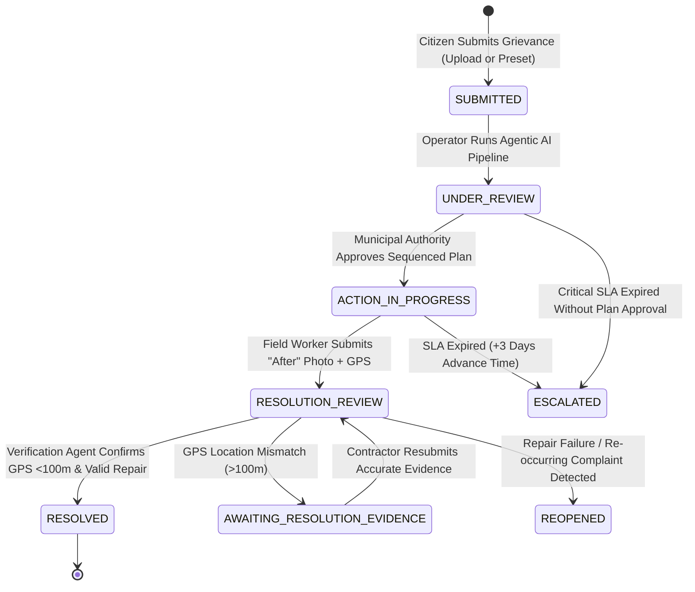

# OmniCivic AI — Project Memory & System Dossier

> **Tagline:** *"Different complaints. One hidden signal."*  
> **Framing Line:** *"Cities don't have a shortage of complaints. They have a shortage of intelligence connecting those complaints."*  
> **Last Updated:** October 2026  
> **Version:** 1.0.0

---

## 1. Executive Summary & Problem Domain

Municipal civic governance across global metropolitan areas suffers from a fundamental systemic bottleneck: **ticket fragmentation and symptom-only remediation**. 

When infrastructure degrades, citizens report surface symptoms independently:
- A commuter reports traffic waterlogging.
- A motorist reports deep potholes.
- A shopkeeper reports cracked asphalt base.
- A resident reports a water pipe leak.

Traditional municipal CRM portals create 4 independent grievance tickets, route them to disparate departments (Roads, Drainage, Water Supply), and close them out of order. The Roads Department paves asphalt over active water pipe leaks, causing the road to erode within 48 hours.

**OmniCivic AI** solves this problem by functioning as an autonomous multi-agent intelligence layer between incoming citizen complaints and municipal action. It clusters proximate reports, invokes external real-world analytical tools, exposes underlying root causes, generates dependency-ordered multi-department work orders, and enforces anti-fraud verification before closing tickets.

---

## 2. Core Architecture & Multi-Agent Pipeline

### 2.1 The 10 Specialized Agents + Agentic Reasoning Engine

```
[Raw Citizen Report]
        │
        ▼
┌──────────────────┐
│ Perception Agent │ (Gemini Multimodal / Deterministic Catalog)
└────────┬─────────┘
        ▼
┌──────────────────┐
│ Clustering Agent │ (Haversine distance <=180m, Time window <=7 days)
└────────┬─────────┘
        ▼
┌───────────────────────────┐
│ Incident Detection Agent  │ (Evaluates Relationship Rules)
└────────┬──────────────────┘
        ▼
┌─────────────────────────────────────────────────────────────┐
│                 Agentic Reasoning Engine                    │
│   ├── Open-Meteo Weather API (48h Rain Forecast)            │
│   ├── OSM Overpass API (Sensitive Sites <250m)              │
│   ├── Civic Dependency Graph (civic_dependencies.json)      │
│   ├── Historical Incidents Lookup (Repeat Failures)         │
│   └── Haversine Spatial Math                                │
└────────┬────────────────────────────────────────────────────┘
        │
        ├─────────────────────────────┬─────────────────────────────┐
        ▼                             ▼                             ▼
┌──────────────────┐        ┌────────────────────┐        ┌──────────────────┐
│ Root-Cause Agent │        │ Civic Impact Agent │        │  Response Agent  │
│ (Causal Chain)   │        │ (0-100 Score)      │        │ (Topological)    │
└────────┬─────────┘        └─────────┬──────────┘        └────────┬─────────┘
        └─────────────────────────────┼────────────────────────────┘
                                      ▼
                            ┌───────────────────┐
                            │   Filing Agent    │ (FILE-[INC_ID])
                            └─────────┬─────────┘
                                      ▼
                            ┌───────────────────┐
                            │    Orchestrator   │ (Atomic Disk Persistence)
                            └───────────────────┘
```

| Agent Name | Source File | Core Responsibility | Technical Method |
| :--- | :--- | :--- | :--- |
| **Perception Agent** | `agents/perception.py` | Extracts issue category, severity, and visual features from photos/text. | Multimodal Gemini API or deterministic lookup table (`perception_lookup.json`). |
| **Clustering Agent** | `agents/clustering.py` | Detects spatial/temporal clusters of related grievances. | Pure Python Haversine math ($d \le 180\text{m}$, $\Delta t \le 7\text{ days}$). |
| **Incident Detection Agent** | `agents/incident.py` | Determines cluster classification. | Rules: `INDEPENDENT`, `DUPLICATE`, `POSSIBLE_CONNECTED`, `HIGH_CONFIDENCE_CONNECTED`. |
| **Reasoning Engine** | `agents/reasoning_agent.py` | Drives multi-turn tool calling and single-turn tool-enriched reasoning. | Dynamic tool loop (Open-Meteo, OSM Overpass, Graph, History) with server-side guardrails. |
| **Root-Cause Agent** | `agents/root_cause.py` | Traces origin failures causing downstream symptoms. | Traversal over `civic_dependencies.json` + LLM cascade hypothesis synthesis. |
| **Civic Impact Agent** | `agents/impact.py` | Computes objective 0–100 threat score. | 6-factor weighted math grounded by live GIS facility proximity. |
| **Response Agent** | `agents/response.py` | Schedules multi-department work orders in valid sequence. | Topological sort enforcing prerequisite dependencies. |
| **Filing Agent** | `agents/filing.py` | Issues formal traceable municipal tracking codes. | Formats simulated municipal filing records (`FILE-[INC_ID]`). |
| **Escalation Agent** | `agents/escalation.py` | Tracks SLA deadlines and alerts senior management upon breach. | State machine transitioner checking deadlines + demo time-travel trigger (+72h). |
| **Verification Agent** | `agents/verification.py` | Validates field resolution proof and blocks contractor fraud. | GPS proximity verification ($<100\text{m}$) + post-repair visual evidence check. |
| **Orchestrator** | `agents/orchestrator.py` | Central controller, execution coordinator, and persistence engine. | Sole authorized writer to `incidents.json` and `agent_logs.json`. |

---

## 3. Technology Stack & Key Dependencies

### 3.1 Backend
- **Python:** 3.10+
- **Web Framework:** FastAPI `0.115.12` running on Uvicorn `0.34.3`
- **Data Modeling:** Pydantic v2 `2.11.3`
- **Networking & Clients:** `httpx>=0.27.0` (asynchronous HTTP for tools & LLMs)
- **Image Processing:** `Pillow>=10.0.0`
- **Cryptography:** `cryptography` (Fernet 256-bit symmetric encryption for stored keys)
- **AI SDKs:** `anthropic==0.53.0`, `google-generativeai>=0.8.0`
- **Configuration:** `python-dotenv==1.1.0`

### 3.2 Frontend
- **Framework:** React 19 (`^19.2.7`) + TypeScript (`~6.0.2`)
- **Build Tool:** Vite (`^8.1.1`)
- **Styling:** Vanilla CSS design tokens (`src/index.css`) + TailwindCSS v4 (`^4.3.2`)
- **Spatial GIS Mapping:** `leaflet` (`^1.9.4`), `react-leaflet` (`^5.0.0`), `@types/leaflet`
- **Icons:** `lucide-react` (`^1.24.0`)
- **Visual Charts:** `recharts` (`^3.9.2`)
- **Routing:** `react-router-dom` (`^7.18.1`)
- **Linting:** `oxlint` (`^1.71.0`)

---

## 4. External Keyless Analytical Tools

To prevent LLM hallucination and ground reasoning in physical reality, the Reasoning Engine invokes external, zero-key APIs:

1. **Open-Meteo Weather API (`get_weather_forecast`):**
   - Retrieves 48-hour precipitation probability and rainfall volume (mm).
   - Informs drainage capacity calculations and flags rainfall-driven compounding risks.
2. **OpenStreetMap Overpass API (`find_nearby_sensitive_sites`):**
   - Discovers schools, hospitals, clinics, and kindergartens within a radius (default 250m).
   - Computes exact Haversine distance to each facility.
   - Employs an in-memory cache to prevent upstream Overpass rate-limiting.
3. **Civic Dependency Knowledge Graph (`query_dependency_graph`):**
   - Evaluates validated causal relationships between municipal issue categories.
4. **Historical Incident Store (`get_historical_incidents`):**
   - Scans past incidents within 180m to identify repeat repair failures.
5. **Haversine Distance Calculator (`compute_distance`):**
   - Pure Python spherical surface distance calculation in meters ($R = 6,371,000\text{ m}$).

---

## 5. Security & Operator Authorization Architecture

### 5.1 Operator Token Guard (`X-Operator-Token`)
- Sensitive administrative endpoints (`/api/settings/*`) are protected by operator token authorization.
- Token discovery precedence:
  1. `OPERATOR_SECRET_TOKEN` environment variable.
  2. Auto-generated 32-character hex token saved in `backend/.operator_token` (gitignored).
- Printed prominently to the server console on startup.
- Development UI provides a 1-click **Authorize Dev Token** button calling `/api/settings/dev-token`.

### 5.2 Fernet 256-Bit Symmetric Encryption at Rest
- Stored LLM provider credentials in `backend/data/provider_configs.enc.json` are encrypted using symmetric Fernet keys.
- Encryption key discovery precedence:
  1. `LLM_ENCRYPTION_KEY` environment variable.
  2. Auto-generated Fernet key in `backend/.secret.key` (gitignored).
- **Key Masking & Overwrite Protection:** Client receives masked keys (`sk-...1234`). Saving a provider config with a masked key preserves the existing decrypted secret on disk.

### 5.3 Supported LLM Providers & Routing
| Provider | Default Model | Tool Calling Support |
| :--- | :--- | :---: |
| **Groq Cloud** | `llama-3.3-70b-versatile` | Supported (LPU Speed) |
| **OpenAI (ChatGPT)** | `gpt-4o-mini` | Supported (Structured) |
| **Anthropic Claude** | `claude-3-5-sonnet-20241022` | Full Multi-turn Loop |
| **Google Gemini** | `gemini-flash-latest` | Multimodal / Tool-Enriched |
| **Hugging Face** | `meta-llama/Llama-3.3-70B-Instruct` | Limited / Custom Model |
| **OpenRouter** | `anthropic/claude-3.5-sonnet` | Router / Custom Model |
| **Ollama / Local** | `llama3.2` | Local Self-Hosted |
| **Deterministic Mock** | `simulation-mode` | 100% Offline / Zero Key |

---

## 6. Incident Lifecycle State Machine



---

## 7. Data Models & JSON Persistence Stores

All state is persisted atomically to JSON stores under `backend/data/`:

- `complaints.json`: Stores all individual citizen complaint reports (`CIV-2026-XXXX`).
- `incidents.json`: Stores clustered incident contexts (`INC-2026-XXX`), causal chains, impact scores, response plans, resolution evidence, and SLAs.
- `agent_logs.json`: Centralized audit trail capturing agent decisions, confidence ratings, timestamps, and evidence used.
- `civic_dependencies.json`: Directed causal dependency graph linking infrastructure breakdown types.
- `departments.json`: Department roles, SLAs, execution priorities, and prerequisite rules.
- `perception_lookup.json`: Deterministic vision catalog providing instant, latency-free classification during offline demos.
- `scenarios.json`: Pre-calibrated demonstration scenarios with coordinates, descriptions, and expected causal cascades.
- `provider_configs.enc.json`: Encrypted provider configurations and active provider state.

---

## 8. Frontend Application Architecture & Theming

### 8.1 Pages & Navigation
1. **Landing Screen (`/` — `LandingPage.tsx`):**
   - Public-facing civic intelligence hero screen with the core framing line and tagline.
   - Live system metrics strip (connected to `/dashboard/stats`): Grievances, correlated incidents, critical hazards, verified resolved, and SLA escalations.
   - Side-by-side comparison of Legacy Municipal CRMs vs OmniCivic AI Multi-Agent architecture.
   - 4-Phase architectural workflow overview (Ingestion, Keyless Tools, Causal Intelligence, Anti-Fraud).
   - Pre-calibrated scenario showcase with 1-click **Run Pipeline Analysis** triggers.
   - Enterprise security and multi-model LLM matrix showcase (Groq, Claude, OpenAI, Gemini, Ollama, Zero-key simulation).
2. **Operations Dashboard (`/dashboard` — `Dashboard.tsx`):**
   - Command center interface with aggregate stat counters.
   - Dual-view spatial feed: **List Feed** (Incident & Report cards) or **Interactive Leaflet Map**.
   - Live **Agent Pipeline** animation tracker (7 horizontal stages with progress metrics).
   - Detailed incident panels: Geo-temporal cluster gallery, Root Cause card with causal chain, Civic Impact gauge, Sequenced Response Plan, and Resolution Verification panel.
3. **Citizen Portal (`/report` — `CitizenReport.tsx`):**
   - Dual submission modes: Live photo upload (with drag-and-drop, MIME validation, GPS auto-detection, and Leaflet pin picker) vs Pre-calibrated demo presets.
   - Auto-navigates to Dashboard (`/dashboard`) with `autoAnalyzeId` navigation state for immediate pipeline analysis.
4. **AI Settings Manager (`/settings` — `Settings.tsx`):**
   - Multi-provider configuration manager with model discovery, custom base URLs, temperature sliders, and key toggles.
   - 1-click **Authorize Dev Token** button.
   - In-flight **Test Connection** diagnostic ping displaying latency in milliseconds.

### 8.2 Theming & Design System
- **Dark Mode (Default):** Deep obsidian/navy command center palette (`#0A0D14`, `#0F1420`, `#161D2E`) with subtle glassmorphic borders and glowing status cues.
- **Light Mode:** Crisp municipal workspace palette (`#F8FAFC`, `#FFFFFF`, `#F1F5F9`).
- **Responsive Leaflet Map:** Switches seamlessly between CartoDB Dark Matter and CartoDB Positron tile layers based on active theme.

---

## 9. Pre-Seeded Demonstration Scenarios

1. **Scenario 1 (Water Infrastructure Cascade — `INC-2026-001`):**
   - *Location:* Chakala Junction, Andheri East (Ward 7).
   - *Cascade:* Underground Water Main Burst $\to$ Road Sub-Base Erosion $\to$ Asphalt Potholes $\to$ Traffic Waterlogging.
   - *Priority:* CRITICAL (88/100).
   - *Key Lesson:* Demonstrates why Roads Department must NOT pave until Water Board replaces pipe.
2. **Scenario 2 (Drainage-Waste Compounding Cycle — `INC-2026-002`):**
   - *Location:* Tilak Nagar Colony, Kurla (Ward 6).
   - *Cascade:* Overflowing Waste Bins $\to$ Storm Drain Grate Clogged $\to$ Street Flooding.
   - *Priority:* HIGH (76/100).
   - *Key Lesson:* Demonstrates Solid Waste clearing prerequisite before Drainage suction crews operate.
3. **Scenario 3 (Electrical Hazard Near Sensitive Site — `INC-2026-003`):**
   - *Location:* Near St. Xavier's High School, Marine Lines (Ward 3).
   - *Event:* Exposed live electrical wire hanging low near school entrance.
   - *Priority:* CRITICAL (91/100) with only 2 complaint reports.
   - *Key Lesson:* Proves public safety priority is driven by real threat and proximity to children, NOT raw complaint count.
4. **Scenario 4 (Recurring Repair Failure & Reopening — `INC-2026-004`):**
   - *Location:* Hill Road, Bandra West (Ward 9).
   - *Event:* Premature pothole repair failure following substandard contractor patch.
   - *Key Lesson:* Automatic incident reopening and contractor audit flag.
5. **Scenario 5: Ambiguous Co-Located Reports (Hard Negative):**
   - *Location:* Dadar Station Plaza, Dadar West (Ward 8).
   - *Event:* Broken streetlight beside commercial garbage overflow at identical GPS coordinates.
   - *Key Lesson:* Proves the system does not falsely cluster unrelated complaints despite spatial co-location.

---

## 10. Developer Playbook & Operational Commands

```bash
# ── BACKEND SETUP & STARTUP ──────────────────────────────────────────────────
cd backend
python -m venv venv
.\venv\Scripts\Activate.ps1       # Windows PowerShell
source venv/bin/activate          # macOS / Linux
pip install -r requirements.txt
python -m scripts.seed_data       # Seed complaints, incidents & logs
python -m uvicorn main:app --host 0.0.0.0 --port 8000 --reload

# ── FRONTEND SETUP & STARTUP ─────────────────────────────────────────────────
cd frontend
npm install
npm run dev                       # Vite dev server at http://localhost:5173
npm run build                     # Type-check and production bundle

# ── AUTOMATED TEST, AUDIT & EVALUATION SUITE ─────────────────────────────────
python -m pytest tests/                         # Unit tests for Tool Loop & Critic
python -m eval.run_eval --mode deterministic    # 20-case quantitative evaluation benchmark
python -m scripts.test_pipeline                 # Full 7-stage pipeline verification
python -m scripts.test_upload_pipeline          # Multipart photo upload test
python -m scripts.test_settings_and_fallback    # Fernet encryption & fallback test
```

---

## 11. Architectural Decisions & Lessons Learned

1. **Zero-Latency Fallback Architecture:** Live multimodal AI APIs can introduce latency or encounter rate limits during live demonstrations. The dual-mode architecture guarantees 100% demo availability by seamlessly falling back to deterministic lookup catalogs (`perception_lookup.json`) without altering pipeline semantics.
2. **Provider-Agnostic Agentic Tool Loop:** Implemented canonical tool schemas (`backend/services/tool_loop.py`) translated dynamically to Anthropic, OpenAI, Groq, OpenRouter, Ollama, and Gemini. Models autonomously select tools rather than receiving pre-called answers.
3. **Critic & Self-Reflection Agent:** Implemented `backend/agents/critic.py` with 6 deterministic and semantic verification rubrics, allowing 1 autonomous revision pass before finalizing incident context.
4. **Topological Guardrails Over Pure LLM Generation:** LLMs can occasionally propose repair steps out of logical order. OmniCivic AI enforces a server-side topological sort guardrail that strictly sorts steps by physical department dependencies (underground utilities $\to$ drainage $\to$ surface paving) before persisting plans.
5. **Rigorous Verification Boundary:** Standardized spatial distance tolerance to strictly $\le 100\text{m}$ across all documentation, agents, and verification panels.
6. **Quantitative Evaluation Harness:** Built `backend/eval/` with 20 ground-truth labeled municipal cases, generating reproducible ablation results (`eval/RESULTS.md`).
7. **Free Address Geocoding Proxy (Task 8):** Implemented backend `/geocode` proxying OpenStreetMap Nominatim with a descriptive User-Agent, 1 request/sec rate limiting, 1-hour in-memory cache, and local landmark fallback. Added a debounced frontend search box and interactive draggable map pin picker without external API keys or Google Maps dependencies.
